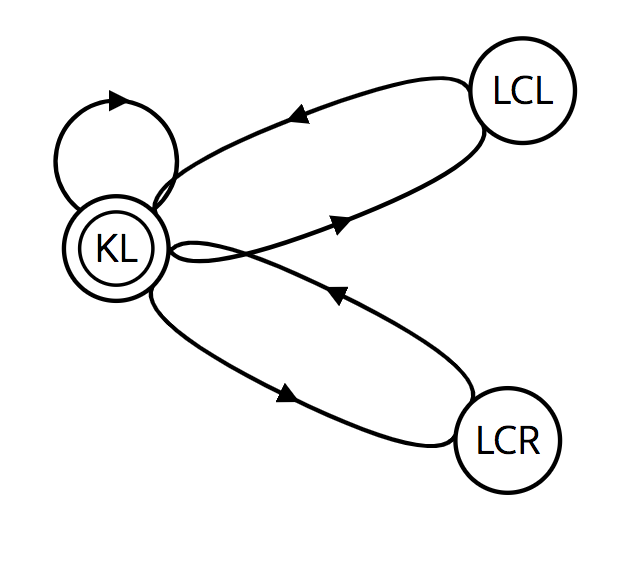

# CarND-Path-Planning-Project
My solution to the path planning project in Udacity

## The project can be divide into two parts:

* The behavior planing: I use the Finite State Machine(FSM) with 3 states
* Path Generation: according to the walkthrough video, I adopt the spline to generate path and smoothing.

## The result

I run the code for a 12 miles test without any collision and the vehicle always stay at the limit speed;


## Detail of the code:

### Project structure:

* main.cpp: The main process and some helper functions are in this file. Besides, the path generation and smoothing part is also in this file;
* vehicle.cpp & vehicle.h: The Vehicle class the describe the properties and functions of the vehicle. And the FSM is defined here. 
* cost.cpp & cost.h: Determine which state is the best by using several cost function. 
* spline.h: The library to do spline.

### FSM
I use a 3 states FSM with states KL, LCL, LCR:

* KL: keep lane, the vehicle stay in its lane
* LCL: lane change left
* LCR: lane change right

The FSM that I used is showed in below:



It seems that use 5 state here would be better here (add the state Prepare lane change left (PLCL) and Prepare lane change right (PLCR)). But I think in
this project, 3 state is enough.

```c++
vector<States> Vehicle::GetReachableState() {
    // all possiable states
    vector<States> r_state;

    if (this->state == KL){
        r_state.push_back(KL);
        if (this->lane != 0){
            // check the lane again
            if (d < (2 + 4 * (lane) + 2) && d > (2 + 4 * (lane) - 2) && speed > 20){
                r_state.push_back(LCL);
            }
        }
        if (this->lane != 2){
            // check the lane again
            if (d < (2 + 4 * (lane) + 2) && d > (2 + 4 * (lane) - 2) && speed > 20){
                r_state.push_back(LCR);;
            }
        }
    } else if (this->state == LCL || this->state == LCR){
        r_state.push_back(KL);
    }
    return r_state;
}
```

The function `Vehicle::GetReachableState` helps to get the possiable next state from the current. In my solution, the FSM 
will check by itself if the ego car can change lane now (e.g. if the ego car is in the lane 0 and its current state is KL, it can't do LCL).

After getting the possiable next state, the cost for each state(behavior) will be calculated and we will get the behavior that have
 minimum cost. Once we get the best behavior, we can get the target lane and the target velocity. The code in the `main.cpp` can use 
 these two variables to generate a point and get a smooth time series path by using a series of point.
 
### Cost Function

In my solution, I just used three cost functions to get a safe, efficient and comfortable behavior planner. The cost I used are:

* CollisionCost: To avoid collision
* InefficiencyCost: To make the ego car driving at limit speed 
* ChangeLaneCost: penalty term to avoid changing lane frequently

Before calculate the total cost, I first use the function `Cost::RealizeState(States s)` to get the prediction of the States s.
The prediction contains:

* The current lane
* The next lane
* target velocity
* is going to collision? (determined by the distance from the back and front car)
* The distance from the front car (next lane)
* The speed of the front car (next lane)
* The distance from the back car (next lane)
* The speed of the back car (next lane)

So if the behavior is KL, than the next lane = current lane. What we really care about is the situation of the next lane.
 So we calculate the back and front car in the next lane.

The most important term of the cost function is the `CollisionCost` .  If the distance from the front car is smaller than 30 m,
we think it's dangerous so the `is_collision` is set true. The relative speed is used to find the time to collision. The cost is calculate by:

```c++
double Cost::CollisionCost() {
    double cost = 0;
    if (predict.is_collision){
        double front_collide_time = 9999;
        double back_collide_time = 9999;

        if (predict.front_distance != 9999){
            //distance divided by the relative speed
            double relative_speed = vehicle->speed - predict.front_speed;
            if (relative_speed > 0){
                // we are now faster than the front car and the distance is < 30 m
                front_collide_time = predict.front_distance / (relative_speed * MPH_TO_MS);
            }
        }
        if (predict.back_distance != 9999){
            double relative_speed = predict.back_speed - vehicle->speed;
            if (relative_speed > 0){
                // we are now slower than the back car and the distance is < 30 m
                back_collide_time = predict.back_distance / (relative_speed * MPH_TO_MS);
            }
        }

        if (front_collide_time <= back_collide_time){
            cost = exp(-pow(front_collide_time, 2)) * COLLISION_WEIGHT;
        } else if(front_collide_time > back_collide_time){
            cost = exp(-pow(back_collide_time, 2)) * COLLISION_WEIGHT;
        }

        if ((predict.next_lane != predict.current_lane) && (front_collide_time > 1.5) && (back_collide_time > 1.5)){
            cost = cost/10.0;
        }

        if((front_collide_time == 9999) && (back_collide_time == 9999)){
            cost = 0;
        }
    }
    return cost;
}
```

### Path Generation and Speed control

This part I followed the project walktrhough and Q&A session.
#### Speed control
The cost.cpp will return a reference lane and target velocity. The reference speed is changed as follow:

```c++
    if (this->ref_vel < final_target_speed && this->ref_vel < 49.5) {
        this->ref_vel += 0.224;
    } else if (this->ref_vel > final_target_speed && this->ref_vel > 0) {
        this->ref_vel -= 0.224;
    }
```

The requirements of this project state that the acceleration and jerk should not exceed 10 m/s² and 50m/s³, respectively. In order to meet this requirement, the car acceleration is increased or decreased by steps of 0.224 m/s². The limit 0.224 is computed as follows: max acceleration of 10 m/s², with delta time of 0.02 seconds in miles per hour:2.24/10

#### Trajectory generation
From this implementation I have reused the path planning solution. Our path planner uses the Spline mathematical function for curve fitting the generated map coordinates. The spline helps to define a smooth path for the car.
 To start calculating the path we take the end of the previous path or the current location of the 
car (if there is no previous path) as a starting point. We take the last two points and include three more. 
These three new points there will be the position of the car in a certain distance. 
In my case: 30, 60 and 90 meters.

After, we shift the orientation to the ego car for simplicity and feed the points to the spline generator.
We used the Cubic Spline library to generate the spline curve (line 303-316 in main.cpp).

After, with the spline function already done, we have to recompute the map points back from the curve.
Considering the time interval of 20 ms, the travel distance of 30 meters on x-axis with the reference velocity `ref_vel`. compute the coordinates from spline and shift its orientation back. (line 330 - 356 in main.cpp)


### Simulator.
You can download the Term3 Simulator which contains the Path Planning Project from the [releases tab (https://github.com/udacity/self-driving-car-sim/releases).

### Goals

* The program can safely navigate around a virtual highway with other traffic that is driving +-10 MPH of the 50 MPH speed limit. 
* The car's localization and sensor fusion data are provided, there is also a sparse map list of waypoints around the highway. 
* The car should try to go as close as possible to the 50 MPH speed limit, which means passing slower traffic when possible, note that other cars will try to change lanes too. 
* The car should avoid hitting other cars at all cost as well as driving inside of the marked road lanes at all times, unless going from one lane to another. 
* The car should be able to make one complete loop around the 6946m highway. Since the car is trying to go 50 MPH, it should take a little over 5 minutes to complete 1 loop. Also the car should not experience total acceleration over 10 m/s^2 and jerk that is greater than 10 m/s^3.

#### The map of the highway is in data/highway_map.txt
Each waypoint in the list contains  [x,y,s,dx,dy] values. x and y are the waypoint's map coordinate position, the s value is the distance along the road to get to that waypoint in meters, the dx and dy values define the unit normal vector pointing outward of the highway loop.

The highway's waypoints loop around so the frenet s value, distance along the road, goes from 0 to 6945.554.

## Basic Build Instructions

1. Clone this repo.
2. Make a build directory: `mkdir build && cd build`
3. Compile: `cmake .. && make`
4. Run it: `./path_planning`.

Here is the data provided from the Simulator to the C++ Program

#### Main car's localization Data (No Noise)

["x"] The car's x position in map coordinates

["y"] The car's y position in map coordinates

["s"] The car's s position in frenet coordinates

["d"] The car's d position in frenet coordinates

["yaw"] The car's yaw angle in the map

["speed"] The car's speed in MPH

#### Previous path data given to the Planner

//Note: Return the previous list but with processed points removed, can be a nice tool to show how far along
the path has processed since last time. 

["previous_path_x"] The previous list of x points previously given to the simulator

["previous_path_y"] The previous list of y points previously given to the simulator

#### Previous path's end s and d values 

["end_path_s"] The previous list's last point's frenet s value

["end_path_d"] The previous list's last point's frenet d value

#### Sensor Fusion Data, a list of all other car's attributes on the same side of the road. (No Noise)

["sensor_fusion"] A 2d vector of cars and then that car's [car's unique ID, car's x position in map coordinates, car's y position in map coordinates, car's x velocity in m/s, car's y velocity in m/s, car's s position in frenet coordinates, car's d position in frenet coordinates. 

## Dependencies

* cmake >= 3.5
  * All OSes: [click here for installation instructions](https://cmake.org/install/)
* make >= 4.1
  * Linux: make is installed by default on most Linux distros
  * Mac: [install Xcode command line tools to get make](https://developer.apple.com/xcode/features/)
  * Windows: [Click here for installation instructions](http://gnuwin32.sourceforge.net/packages/make.htm)
* gcc/g++ >= 5.4
  * Linux: gcc / g++ is installed by default on most Linux distros
  * Mac: same deal as make - [install Xcode command line tools]((https://developer.apple.com/xcode/features/)
  * Windows: recommend using [MinGW](http://www.mingw.org/)
* [uWebSockets](https://github.com/uWebSockets/uWebSockets)
  * Run either `install-mac.sh` or `install-ubuntu.sh`.
  * If you install from source, checkout to commit `e94b6e1`, i.e.
    ```
    git clone https://github.com/uWebSockets/uWebSockets 
    cd uWebSockets
    git checkout e94b6e1
    ```

## Code Style

 [Google's C++ style guide](https://google.github.io/styleguide/cppguide.html).

